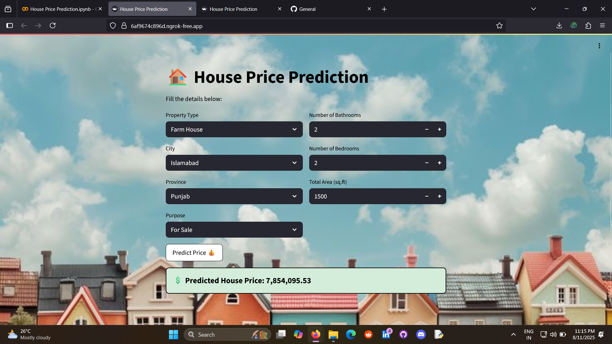
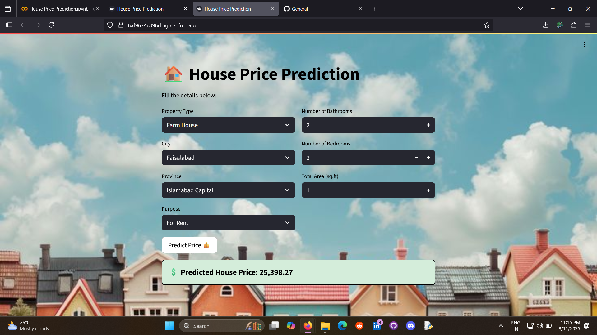

# House Price Prediction

A simple, practical regression project that predicts house selling and rental prices. Built with Python, scikit-learn (RandomForest), and deployed as a Streamlit web app.

---

## Table of contents

* EDA
* Data Loading
* Data summary
* Identifying null values
* Identifying duplicate values
* Univariate and Bivariate Analysis
* Outliers
* Correlation
* Data preprocessing
* Feature Engineering
* Encoding
* Machine learning
* Streamlit Part

---




---

## Project overview

This repository shows how I prepared data, engineered features, trained a Random Forest regression model, and deployed it as a Streamlit app that returns price predictions.

> Key point: the model was trained on `log1p(price)` and app converts predictions back to original scale using `expm1`.

---

## EDA

Exploratory analysis to understand the data and guide preprocessing decisions. Typical checks performed:

* Value distributions (histograms)
* Missing value patterns (heatmap / missing counts)
* Categorical value counts
* Quick visual checks (boxplots, scatter plots)

---

## Data Loading

Load CSV files into pandas DataFrames. Example:

```python
import pandas as pd
train = pd.read_csv('data/train.csv')
test = pd.read_csv('data/test.csv')
```

Combine train and test for consistent preprocessing, then split back before training.

---

## Data summary

Use `.info()`, `.describe()` and `.head()` to check column types, ranges, and example rows.

---

## Identifying null values

Find columns with missing data and decide fill strategy:

```python
train.isnull().sum()
```

Typical fills used:

* Numeric → median
* Categorical → `'Unknown'` or `'None'`

---

## Identifying duplicate values

Remove exact duplicate rows to avoid biased training:

```python
train = train.drop_duplicates()
```

---

## Univariate and Bivariate Analysis

* Univariate: distribution of `price`, `Total_Area`, `bedrooms`, `baths`.
* Bivariate: relationship between `price` and key features using scatterplots or boxplots.

---

## Outliers

Detect with boxplots or percentile thresholds. Common action:

```python
train = train[train['Total_Area'] < train['Total_Area'].quantile(0.99)]
```

Remove or cap extreme values after careful review.

---

## Correlation

Compute correlation matrix to find strong predictors and multicollinearity:

```python
corr = train.corr()
```

Visualize with a heatmap.

---

## Data preprocessing

* Fill missing values as decided above
* Scale or transform where needed (trees don’t require scaling)
* Target transform: `y = np.log1p(price)` during training

---

## Feature Engineering

Create helpful derived variables used by the model:

* `baths_per_bedroom = baths / (bedrooms + 1)`
* `area_per_bedroom = Total_Area / (bedrooms + 1)`
* `area_per_bath = Total_Area / (baths + 1)`
* `total_rooms = bedrooms + baths`
* `province_city = province_name + '_' + city`

These often improve model performance by exposing non-linear relationships.

---

## Encoding

Encode categorical columns using `LabelEncoder` (saved as `.pkl` files) so the same mapping is used at inference time. Example:

```python
from sklearn.preprocessing import LabelEncoder
le = LabelEncoder()
train['city_enc'] = le.fit_transform(train['city'])
# save encoder
import pickle
pickle.dump(le, open('models/city_encoder.pkl','wb'))
```

---

## Machine learning

* Try multiple regressors (DecisionTree, RandomForest, ExtraTrees, GradientBoosting)
* Check bias/variance; RandomForest chosen for stability
* Use `GridSearchCV` or `RandomizedSearchCV` for tuning (optional)
* Evaluate with R², RMSE, and residual plots

Model saved as `models/randomforest_model.pkl`.

---

## Streamlit Part

The app (`app.py`) loads encoders and model `.pkl` files, accepts user inputs (property\_type, city, province, baths, purpose, bedrooms, Total\_Area), applies the same feature engineering, predicts `log1p(price)`, and shows the final price using `np.expm1`.

Run locally:

```bash
pip install -r requirements.txt
streamlit run app.py
```

Run in Colab with a tunnel (ngrok/cloudflared) — see notebook for an example.

---

## Notes

* Don’t commit large raw datasets to GitHub. Add a small sample if needed.
* If you retrain the model, re-generate encoder `.pkl` files.
* Ensure `app.py` uses the exact feature order the model expects.

---

## 📢 Author

👨‍💻 **Sarathkumar Soundarrajan**
📌 LinkedIn: (https://www.linkedin.com/in/sarathkumar271002/))
📌 GitHub: (https://github.com/sarathkumar271002)
